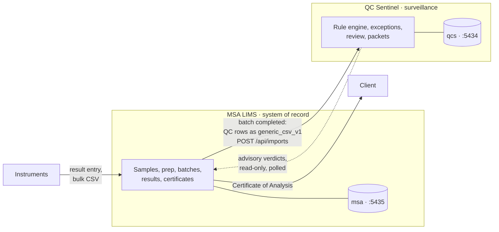

# Architecture — two systems, one seam

MSA LIMS and QC Sentinel are separate systems, separate repositories, separate
databases, separate deployments. They cooperate across one narrow interface.
This document explains why, and what crosses it.

---

## Why not one system

QC Sentinel was built first, and its engineering claims depend on it *not* being
a LIMS:

- Its PRD names "sample-of-record management (LIMS territory)" as a **non-goal**.
- "Scope creep into LIMS" is a tracked risk in its register.
- It enforces **no LIMS write-backs, ever** — it never blocks reporting,
  generates work orders, or routes samples. Disposition is advisory.
- Its append-only guarantee, its versioned immutable rule sets, and its
  reproducible-verdict replay all describe a system that *observes* a process it
  does not control.

Absorbing that into a LIMS would demolish the story. A surveillance system that
also owns the data it judges is not a surveillance system.

There is also a practical argument. Real laboratory IT looks exactly like this:
a system of record and a set of systems around it, integrating over files. A
portfolio that demonstrates a clean integration between two independently
deployable services says more about senior engineering judgement than one large
application does.

---

## The topology

The dotted line matters: it is **read-only and advisory**. Sentinel has no
credentials for the LIMS database and no endpoint to call. The LIMS polls
Sentinel and displays what it finds, and a failing verdict does not stop a
result being reported. A person decides that.

---

## What crosses the seam

**Outbound (LIMS → Sentinel).** When a batch reaches `completed`, the LIMS
exports the QC rows in that batch — CRMs, blanks, duplicates, with their
measured values, the CRM lot and its certified values, the instrument, and the
method — in a format Sentinel's **existing parsers already read**:
`generic_csv_v1` (flat, one result per row) or `wide_icp_v1` (one sample per
row, one column per analyte). It posts them to Sentinel's `POST /api/imports`.

**Inbound (Sentinel → LIMS).** Nothing is pushed. The LIMS polls Sentinel's
read endpoints for verdicts on batches it has submitted and renders them beside
the batch, with a link into Sentinel's investigation UI.

That is the whole interface. The critical property: **this requires no changes
to QC Sentinel at all.** If the integration needs a new Sentinel endpoint, the
seam has been drawn in the wrong place.

---

## What each system owns

| | MSA LIMS | QC Sentinel |
|---|---|---|
| Sample identity and custody | ● | — |
| Preparation records | ● | — |
| Fire assay batching, crucibles, flux | ● | — |
| Analytical results | ● owns and issues | ○ reads copies as context |
| QC material **insertion** | ● | — |
| QC **evaluation** and verdicts | — | ● |
| Control charts | — | ● |
| Exception workflow, investigation packets | — | ● |
| Certificates of analysis | ● | — |
| Reporting decision | ● | ○ advises only |

The split on results is the subtle one. Both systems hold result values, but for
different purposes and with different authority: the LIMS *issues* them, and
Sentinel holds copies as evidence for a QC judgement. Sentinel can never amend a
result, and the LIMS never asks Sentinel what a result should be.

---

## Failure behaviour

Sentinel being unavailable must never stop the laboratory working. The
integration is off by default (`MSA_SENTINEL_ENABLED`), non-fatal when it fails,
and `GET /health` reports it as **`degraded` at HTTP 200** rather than
unhealthy. Only the database being unreachable makes the LIMS unhealthy.

Paging somebody at 3am because a surveillance system went down — one the lab
does not need in order to assay samples — would be a design error, not a
monitoring one.

---

## Deployment

Both run on the same OCI free-tier VM (155.248.230.60), as separate containers
with separate Postgres instances: Sentinel on 5434, the LIMS on 5435. They share
nothing but the host and, eventually, an OIDC provider, so one login covers both
in a demo.

Each repository stands alone: `git clone && docker compose up` brings up that
system by itself. A combined compose file for the joint demo arrives in Phase 5,
and it composes the two rather than replacing either.
